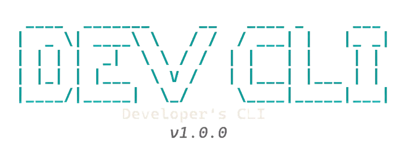

  
   

       

# DevCLI - Developer Command Line Interface

DevCLI is a terminal-based development workspace that consolidates essential
developer tools into a single unified interface. It manages projects, files,
virtual environments, and provides AI-powered assistance without requiring
you to leave the command line.

The application is built using Go and the Bubble Tea framework, providing a
fast and responsive terminal user interface that works across all major
operating systems.

## Table of Contents

*   [DevCLI](#devcli)
*   [Installation & Requirements](docs/INSTALLATION.md)
*   [Core Features](docs/FEATURES.md)
*   [Usage & Shortcuts](docs/USAGE.md)
*   [Configuration](docs/CONFIGURATION.md)
*   [Architecture](docs/ARCHITECTURE.md)
*   [Contributing](CONTRIBUTING.md)
*   [License](LICENSE)
*   [Code of Conduct](CODE_OF_CONDUCT.md)
*   [Disclaimer](DISCLAIMER.md)

## Premium Web Compiler

DevCLI now includes a premium, web-based IDE for Python and other languages.

*   **Premium UI**: A sleek, glassmorphic interface with modern aesthetics.
*   **Authentication**: Secure account-based access to your workspace.
*   **Smart Storage**: Automatic local synchronization and cloud storage placeholders.
*   **Integrated Terminal**: Run shell commands directly in the browser.

## Documentation

Comprehensive documentation is available in the `docs/` directory:

*   [**Installation Guide**](docs/INSTALLATION.md): System requirements and installation methods.
*   [**Features**](docs/FEATURES.md): Detailed overview of all tools properly explained.
*   [**Usage Guide**](docs/USAGE.md): Interactive mode, subcommands, and keyboard shortcuts.
*   [**Configuration**](docs/CONFIGURATION.md): How to configure AI providers and preferences.
*   [**Architecture**](docs/ARCHITECTURE.md): Project structure and dependencies.

## Contributing

Contributions are welcome. Please ensure code follows Go conventions and includes appropriate tests. Use gofmt for code formatting.

Please review our [Contributing Guidelines](CONTRIBUTING.md) and [Code of Conduct](CODE_OF_CONDUCT.md) before contributing.

## License

This project is licensed under the Apache License 2.0 - see the [LICENSE](LICENSE) file for details.

## Support

For issues, questions, or feature requests, please use the GitHub issue tracker at https://github.com/phravins/devcli/issues

## Disclaimer

Please read the full [Disclaimer](DISCLAIMER.md) before using this software.

Happy Coding!
-------------
